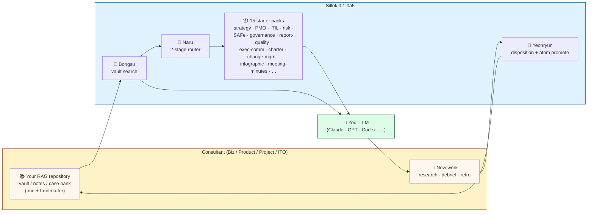
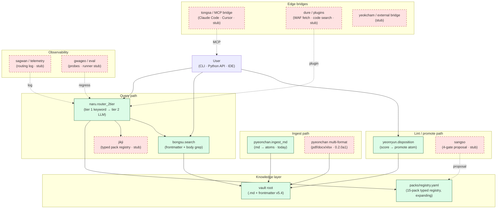

# Sillok

> Proposal-only LLM Operating System with two-stage routing.
> Born from UNESCO Memory of the World heritage (Sillok 1997 · Jikji 2001 · Janggyeong 2007).

**Languages:** English · [한국어](README.ko.md)

[](https://pypi.org/project/sillok/)
[](LICENSE)
[](https://github.com/sillok-os/sillok/actions)
[](docs/architecture/frontmatter-compatibility.md)

---

## Reading order

This README is organized as **value → use cases → install → use → maintain**. Read top-to-bottom on first visit; jump by part on return visits.

1. [Part 1 — Value & Overview](#part-1--value--overview) — what Sillok is and what you get
2. [Part 2 — Business Use Cases](#part-2--business-use-cases) — find your role and a workflow that fits
3. [Part 3 — Installation](#part-3--installation) — requirements and setup paths
4. [Part 4 — Usage](#part-4--usage) — what actually works in `0.1.0a5` and how to drive it
5. [Part 5 — Maintenance & Extension](#part-5--maintenance--extension) — troubleshoot, deploy at scale, extend with your domain
6. [Part 6 — Appendix](#part-6--appendix) — license, prior art, citation

---

## Part 1 — Value & Overview

### What you get

- **15 starter prompt packs** out of the box (strategy, PMO, ITIL, risk, SAFe, exec-comms, governance, report-quality, charter, change-mgmt, infographic, meeting-minutes, tool-adoption, …)
- **2-stage router** — picks the right pack(s), then picks the right retrieval plan
- **5 retrieval plans** — `wiki_first`, with-fallback, recovery-first, dual-compare, no-corpus
- **Reason-coded output** — every routing decision tagged R1~R7 (audit-ready)
- **Proposal-only governance** — 4-gate review pipeline, no silent overwrites
- **No API key needed** for routing itself. Add `--execute` + your key to invoke an LLM.
- **No external corpus dependency** — the starter corpus and all integrations ship with `sillok`. No third-party knowledge base or wiki tool to install.

### Architecture at a glance

Two views of the same system. **Read the Business view first** if you're evaluating Sillok for consulting use; **read the Technical view** if you're integrating, extending, or debugging it.

#### Business view — how a consultant gets value



**The loop, in one sentence:** point Sillok at your vault → ask a question → it picks the right pack(s) and pulls the relevant atoms → your LLM answers → the answer feeds back into the vault as new atoms → next query is smarter.

#### Technical view — module data flow



**Legend:** green solid = production-path in `0.1.0a5` · red dashed = stub / Phase 1 / `0.2.0a1`. Every solid node has a `python -m sillok.<module>...` CLI you can run today.

### Framework coverage — what Sillok integrates

Sillok's **roadmap** covers **5 axes / 25 categories / 110+ global standards** under one registry, one router, one proposal-only governance gate. **`0.2.0a1` ships ~9 of those 25 categories (15 starter packs)**; the rest land additively per milestone.

```
[Axis 1] Governance     [Axis 2] Delivery       [Axis 3] Industry        [Axis 4] Business      [Axis 5] AI/Eng
├─ ERM/EA            ✅  ├─ PMBOK 8         ✅  ├─ Automotive        ⏳ ├─ Strategy/BM    ✅  ├─ AI/LLM Eng    🚧
├─ Risk Quant        🚧 ├─ SAFe 6.0        ✅  ├─ Medical Device    ⏳ ├─ M&A/Finance    ⏳ └─ Prompt Seq    ⏳
├─ ITIL/ITSM         ✅  ├─ Change Mgmt     🚧 ├─ Banking           ⏳ ├─ SaaS/Pricing/GTM ◐
└─ Security/Compl    🚧 └─ Org Design      🚧 ├─ Insurance         ⏳ ├─ Growth/Data    ⏳ [Aux] Output
                                              └─ Embedded SW       ⏳ └─ UX/Discovery   ⏳ ├─ Ext delivery   ◐
                                                                                          ├─ Content publish ⏳
✅ ships in 0.1.0a5 today                                                                  ├─ Report quality ✅
◐ partial ship in 0.1.0a5                                                                  ├─ Enterprise B2B ⏳
🚧 queued for 0.2.0a1 (Phase 1)                                                            ├─ Design system  ⏳
⏳ queued for 1.0.0 GA                                                                     └─ Diagram/Image  ⏳
```

#### What ships in 0.1.0a5

| Category | Pack(s) | Standards |
|---|---|---|
| ERM · IT Governance · EA | `governance-standards` | COSO ERM 2017 · ISO 31000 · COBIT 2019 · TOGAF 10 ADM · Three Lines |
| ITIL · ITSM | `itil-operations` | ITIL v4 · 5-Why + Ishikawa · Blameless PM · BIA · DR runbook |
| Project · Portfolio | `pm-enhanced` + `portfolio-governance` + `risk-uncertainty` | PMBOK 8 · Stage-Gate · Power-Interest · Kraljic |
| SAFe Agile | `safe-agile-delivery` | SAFe 6.0 · PI Planning · WSJF · ROAM · Lean Portfolio · I&A |
| Strategy · Market · BM | `consulting-strategy-audit` | Porter 5F · Ansoff · Blue Ocean · BMC · TAM/SAM/SOM · Pyramid · SCQA |
| SaaS · Audit (partial) | `consulting-saas-audit` | SaaS audit lens — pricing/GTM packs queued for 1.0.0 GA |
| Executive communication | `exec-communication` | Pyramid · SCQA · 10-slide Board · 1-Pager · Sequoia · MD&A |
| Report quality | `report-quality` | CRAAP · AIMQ · IQF · Bond Triangulation |

> 📚 **Full inventory** — 25 categories × 110+ standards × ship status × persona pairing in [`docs/architecture/framework-coverage.md`](docs/architecture/framework-coverage.md).

### Top 10 features

The 10 capabilities below are what differentiate Sillok from a plain RAG notebook, an Obsidian vault, or a single prompt-router script. Feature 1 is the foundational loop; the rest layer governance, eval, and multi-tool reach on top.

| # | Feature | What it does | Module(s) |
|---|---|---|---|
| 1 | **Multi-format Auto-Ingest RAG** | Auto-builds your personal RAG corpus from `md` / `pdf` / `docx` / `xlsx` / `pptx` / `txt` / `hwpx` (Korean) and re-learns incrementally on file change (`watch`), on schedule (`cron`), or on demand. First-run bootstrap + delta re-index — no full re-scan. | `pyeonchan` + `janggyeong` |
| 2 | **Two-Stage Routing** | Tier 1 keyword/regex match → Tier 2 LLM intent classification. Loads only the packs and corpus slice each query needs. ~97% token reduction vs. always-on full context. | `naru` |
| 3 | **Typed Pack Registry + 5 Retrieval Plans** | Every pack declares its `corpus_affinity.retrieval_plan`: `vault_first`, `vault_then_llmwiki_fallback`, `llmwiki_recovery_first`, `dual_compare`, or `no_corpus`. Routing is data-driven, not heuristic. | `jikji` + `bongsu` |
| 4 | **Proposal-Only 4-Gate Governance** | Auto-growth and eval feedback **never** overwrite system prompts or pack bodies directly. All changes land in `prompts/system/proposals/` and pass a 4-gate review (lint → diff → eval delta → human approval). Hard guard against prompt drift and corpus poisoning. | `sangso` |
| 5 | **Multi-Tenant Overlay (scoped corpora)** | Personal vault + team vault + per-client vault are composed as permission-scoped layers. The same router serves a solo user and a 1,000-person org without re-architecting. | `beopjeon` (scope) + `janggyeong` |
| 6 | **MCP Bridge** | The same corpus and packs are exposed over Model Context Protocol — usable from Claude Code, Cursor, Codex CLI, Continue, ChatGPT Desktop. No tool lock-in. | `tongsa` |
| 7 | **Plugin System** | Third-party capabilities (WAF-aware web fetch, symbolic code search, browser automation, doc-fetch) are registered like packs and selectable by the router. Extending Sillok does not require forking it. | `dure` |
| 8 | **Eval Golden Probes + KPI Guard** | Built-in 17-probe regression suite across 6 query families. CI gate: citation coverage 100%, retrieval p50 ≤ 10 s, ≥ 30% token reduction vs. baseline, blind-spot promotion ≤ 7 days. | `gwageo` |
| 9 | **Cross-Tool Plan SSoT** | `docs/plans/<ID>-plan.md` is shared across Claude Code, Codex, Cursor — start a plan in one tool, finish it in another. The router reads the same plan as the executor. | `madang` + `tongsa` |
| 10 | **Failure Taxonomy + Replay Pointer** | Every closeout (`pm-done`) emits a 5-class failure tag (`hallucination` / `routing-miss` / `corpus-gap` / `pack-drift` / `governance-bypass`) and replay coordinates (commit + state snapshot). History becomes learnable, not anecdotal. | `sagwan` + `gwageo` |

> Feature 1 is the **core loop** that makes the other nine compounding. Without continuous multi-format ingest, the corpus stales and every downstream guarantee (routing precision, eval probes, governance proposals) decays.

---

## Part 2 — Business Use Cases

### Persona pairing — find your category fast

Match yourself to a row, then jump to the matching workflow archetype below.

| Your role | Category to start with | Lands in |
|---|---|:-:|
| Strategy / Biz Consultant (A1) · Product Manager · CPO/CSO/CEO | **#14 Strategy/BM** + #16 SaaS + #21 Exec comms | ✅ today |
| Project Consultant (PMP) · PjM/PMO Lead · COO/PfM | **#5 PMBOK** + #6 SAFe + #2 Risk | ✅ today |
| ITO/ITIL Consultant · SRE/ITSM · CIO/CISO | **#3 ITIL** + #1 ERM + #4 Security (queued) | ✅ today |
| Risk Consultant (FAIR) · Risk Engineer · CRO | **#1 ERM** + #2 Risk Quant | ✅ + 🚧 0.2.0a1 |
| AI Solution Architect · ML Engineer · CTO/CDO | #19 AI/LLM Eng | 🚧 0.2.0a1 |
| Industry SME (Auto / Med / Banking / Insurance / Embedded) | #9~#13 | ⏳ 1.0.0 GA |

> 🤝 **Adding a pack for your domain?** The 17–18 categories not yet shipped are intentionally left for domain SMEs. Step-by-step in [`docs/contributing/extending-with-your-domain.md`](docs/contributing/extending-with-your-domain.md) — pack anatomy, sanitization, standards citation, and the 5-step quality gate.

### Common workflows

Three archetypes covering most consulting / PM / AI-builder usage today.

#### Senior consultant
```bash
pip install sillok sillok-mcp
sillok init
sillok corpus install --starter
sillok overlay create --client acme    # client-scoped customization
# Then use @sillok inside Claude Code / Cursor.
```

#### Team lead / internal PM
```bash
pip install sillok
sillok init --registry https://internal.example.com/sillok-registry.yaml
# Pulls your company's standard pack registry on init.
```

#### AI agent builder
```bash
pip install sillok sillok-mcp
python - <<'EOF'
from sillok import route_message
result = route_message("Generate a risk register for a Phase-2 ERP rollout")
print(result.applied_packs)        # ['pm-enhanced', 'risk-uncertainty']
print(result.retrieval_plan)       # 'wiki_first'
print(result.confidence)           # 'high'
EOF
```

> Workflows above describe the **GA experience** (`>=1.0.0`). For what works in the current alpha (`0.1.0a5`), see [Part 4 — Usage](#part-4--usage).

---

## Part 3 — Installation

### Requirements

- **Python 3.11+** (3.12 recommended)
- **pip** or **uv**
- macOS 13+ / Ubuntu 22.04+ / Windows 11 + WSL2

Optional:
- `ANTHROPIC_API_KEY` or `OPENAI_API_KEY` — to actually run the model
- An MCP-compatible IDE (Claude Code, Cursor, Continue) — for in-editor use
- Docker — only if you self-host the corpus

### Quickstart (60 seconds) — *GA target*

> **Status (2026-04-27)**: this Quickstart describes the **GA experience** (`>=1.0.0`). The current shipped version is `0.1.0a5` (alpha). For what works **today**, jump to [Part 4 — Usage](#part-4--usage).

```bash
pip install sillok               # 1.0.0+ (GA target)
sillok init
sillok route "Draft a Q3 strategy report for Acme Corp"

# Expected output:
# applied prompt packs: consulting-strategy-audit, exec-communication
# retrieval plan:       wiki_first
# confidence:           high (0.91)
# reason codes:         R1 R3
```

You're routing. That's it.

### Setup paths

Three stages. Each builds on the previous. Stop wherever you have what you need.

#### 1. Basic Setup — solo user (≈ 5 min)

```bash
# Install
pip install sillok

# Create a workspace and initialize
mkdir my-work && cd my-work
sillok init

# Expected output:
# ✓ Created .sillok/config.toml
# ✓ Created .sillok/overlay.yaml  (empty — your customizations go here)
# ✓ Created .sillok/state/
# Run `sillok route "<your message>"` to test.

# First routing test (no LLM call yet)
sillok route "Quarterly OKR draft for the product team"

# Expected output:
# applied prompt packs: pm-enhanced, exec-communication
# retrieval plan:       wiki_first
# confidence:           high (0.88)
# reason codes:         R1 R3 R4

# Now actually call the model (needs API key)
export ANTHROPIC_API_KEY=sk-ant-...
sillok route "Quarterly OKR draft" --execute

# Expected: the model's actual answer, generated with the routed system prompt.
```

That's the whole basic workflow. The starter packs cover most everyday consulting / PM / IT-ops tasks.

#### 2. MCP Integration — IDE (Claude Code / Cursor / Continue, +5 min)

Use Sillok routing directly from your IDE chat through the **MCP Server (통사;Tongsa)**.

```bash
pip install sillok-mcp
```

**Claude Code** — add to `~/.claude/settings.json` or project `.mcp.json`:

```json
{
  "mcpServers": {
    "sillok": {
      "command": "sillok-mcp",
      "args": ["serve", "--stdio"]
    }
  }
}
```

**Cursor** — same shape, save to `~/.cursor/mcp.json`.

**Continue** — see `docs/integrations/continue.md`.

Restart your IDE, then in chat:

```
> @sillok route "PMO setup for SAP S/4HANA migration"
```

```text
# Expected output (in IDE chat):
# applied prompt packs: pm-enhanced, safe-agile-delivery, change-management
# retrieval plan:       wiki_first
# confidence:           high
# reason codes:         R1 R3
```

If you see that line, MCP is wired up. Sillok now routes every `@sillok` request from inside your editor.

#### 3. Advanced — RAG Corpus (장경;Janggyeong) (+10 min)

Boost retrieval accuracy by attaching a curated knowledge corpus. Pick one option:

**A. Use the official starter corpus** (recommended for most users)

```bash
sillok corpus install --starter

# Expected output:
# Downloading 234 atoms (12 MOC entries)...
# ✓ Installed to ~/.sillok/corpus/
# ✓ FTS5 index built (47 ms)
```

**B. Link an existing folder** (Markdown notes with frontmatter v5.4 — e.g. an Obsidian vault, a docs site, or a personal wiki)

```bash
sillok corpus link --path /path/to/your/notes

# Expected output:
# Validating frontmatter v5.4 ...
# ✓ 412 atoms registered (98% schema-compliant)
# ⚠ 8 atoms skipped (frontmatter incomplete — see corpus.log)
```

> Note: Sillok's corpus format is just plain Markdown + a YAML frontmatter
> schema. There is no separate tool to install. Any folder of Markdown files
> that follow the schema works.

**C. Start empty, accumulate over time**

```bash
sillok corpus init --empty
# Atoms accumulate as you work via the curation pipeline (편찬;Pyeonchan).
```

Verify it's working:

```bash
sillok corpus stats

# Expected output:
# Total atoms: 234   (pattern: 78  case: 56  prompt: 41  decision: 28  template: 19  checklist: 12)
# MOC entries: 12
# Last indexed: 2026-04-26 14:30:11

sillok route "B2B SaaS tier-pricing case studies" --show-corpus

# Expected output:
# applied packs: saas-pricing-packaging, consulting-strategy-audit
# corpus retrieved (5 atoms):
#   - case/2024-stripe-tier-revamp.md
#   - pattern/value-based-pricing.md
#   - decision/2025-pricing-experiment.md
#   - case/2023-figma-pricing-pivot.md
#   - prompt/saas-pricing-discovery.md
```

---

## Part 4 — Usage

### Consultant Quickstart for 0.1.0a5 — *what works today*

If you're a Biz / Product / Project / IT / ITO consultant and you only want to **point Sillok at your own RAG repository** and use it now, this section is the entire story for `0.1.0a5`. The unified `sillok` command and `@sillok` IDE bridge are still alpha-stubs — but the **Python module CLIs** below are production-path.

#### A. Index your own vault (5 min)

```bash
pip install "sillok>=0.1.0a5"

# Your vault = any folder of .md files with YAML frontmatter
# (Obsidian, plain notes, docs site, your case bank — all work).
python -m sillok.bongsu.search --vault ~/Documents/my-vault --stats

# Filter by frontmatter + body grep (rg → grep fallback):
python -m sillok.bongsu.search --vault ~/Documents/my-vault \
    --scope acme --type pattern --query "pricing" --format full
```

#### B. Pick the right starter pack(s) for a query

```bash
python -m sillok.naru.router_2tier --message "Draft a Q3 strategy for Acme"

# Output:
# applied prompt packs: consulting-strategy-audit, exec-communication
# tier breakdown:       discovery_tier=2 → 10 packs scanned, 2 selected
```

The 15 starter packs ship inside the wheel — find their full bodies at:

```bash
python -c "import sillok, os; print(os.path.dirname(sillok.__file__))"
# Then look at the sibling 'packs/' tree:
ls "$(python -c 'import sillok, os; print(os.path.dirname(os.path.dirname(sillok.__file__)))')/packs"
# packs/consulting/  packs/methodology/  packs/output-styles/  registry.yaml
```

#### C. Attach the routed pack(s) to your LLM (manual today)

The unified `sillok route --execute` is GA-target. Today you copy the routed pack body into your LLM's system prompt by hand — or in Claude Code / Cursor / Codex CLI use a one-liner:

```bash
ROUTED=$(python -m sillok.naru.router_2tier --message "Draft a Q3 strategy for Acme" --json | jq -r '.packs[].id')
for p in $ROUTED; do
  cat "packs/**/$p.md"
done > /tmp/system-prompt.md
# Then attach /tmp/system-prompt.md as system prompt to your LLM of choice.
```

(GA: `sillok route --execute "..."` does this in one call.)

#### D. Promote new outputs back to the vault (atom auto-extraction)

```bash
# Score a single result file
python -m sillok.yeonryun.disposition research/2026-04-27-pricing-debrief.md

# Sweep a folder + auto-extract reusable atoms
python -m sillok.yeonryun.disposition --scan research/ \
    --auto-extract \
    --target-dir ~/Documents/my-vault/40_Knowledge/auto \
    --vault ~/Documents/my-vault \
    --source-repo your-org/playbooks
```

#### E. Auto-ingest your raw notes folder (md, today)

```bash
python -m sillok.pyeonchan.ingest_md \
    --vault ~/Documents/my-vault \
    --out ~/.sillok/index.jsonl
```

> Multi-format ingest (`pdf` / `docx` / `xlsx` / `pptx` / `hwpx`) and watch/cron daemonization land in `0.2.0a1` (Pyeonchan Phase 2). For now, anything you can express as `.md` + frontmatter is indexed.

### Common commands (GA target)

```bash
sillok route "<message>"                  # Pick packs + retrieval plan (no LLM call)
sillok route "<message>" --execute        # Same, plus call the LLM and print answer
sillok route "<message>" --show-corpus    # Plus show retrieved atoms

sillok packs list                         # All available packs
sillok packs info pm-enhanced             # Single-pack details

sillok overlay create --client <name>    # New client/team overlay
sillok overlay use <name>                 # Activate it for this shell
sillok overlay list                       # Show all overlays

sillok corpus stats                       # Knowledge corpus health
sillok corpus reindex                     # Rebuild FTS5 index

sillok eval run --suite router-goldens    # Regression: 30 router goldens
sillok eval run --suite rag-probes        # Regression: 17 RAG probes

sillok sync                               # Drift check across config + registry
sillok doctor                             # One-shot diagnostic snapshot
```

All commands accept English aliases:
```bash
sillok telemetry tail   ≡   sillok sagwan tail
sillok eval run         ≡   sillok gwageo run
```

### What 0.1.0a5 does **not** yet provide

| Capability | Status | Lands in |
|---|:-:|:-:|
| `sillok ...` unified command | ⏳ stub | `0.2.0a1` |
| `sillok corpus install --starter` | ⏳ not implemented | `0.2.0a1` |
| `@sillok` MCP bridge for IDEs | ⏳ Tongsa stub | Phase 1 PR-D |
| Multi-format ingest (pdf/docx/xlsx/pptx/hwpx) | ⏳ md only | `0.2.0a1` (Pyeonchan Phase 2) |
| Proposal-only 4-gate governance executor | ⏳ Sangso stub | Phase 1 PR-A |
| Eval CI blocking gate | ⏳ probes only, runner missing | Phase 1 PR-B |

If any of those are dealbreakers, stay on the alpha and watch the milestones — the Python module CLIs in §A–E above will keep working once the unified surface lands.

---

## Part 5 — Maintenance & Extension

### Troubleshooting

```text
sillok: command not found
  → pip install --user sillok, then add ~/.local/bin to PATH

Corpus not found
  → sillok corpus install --starter

MCP server timeout in IDE
  → pip install sillok-mcp; restart the IDE

Overlay validation failed
  → sillok overlay validate <name>      # see exact field error

Drift detected in registry.yaml
  → sillok sync --registry              # re-fetch + reconcile

Routing slow (>10s)
  → sillok corpus reindex
  → sillok config set discovery_tier 2  # 2-tier router for big registries

LLM execution fails
  → check ANTHROPIC_API_KEY / OPENAI_API_KEY
  → sillok doctor                       # full environment dump
```

### Multi-user / company-wide deployment

The instructions above assume **one user on one laptop**. If 50+ people need shared packs, a shared corpus, RBAC, or audit-grade governance, **do not** simply install on every laptop — you'll fragment the corpus and lose audit trail.

See [`docs/enterprise-deployment.md`](docs/enterprise-deployment.md) for:
- Git-backed shared corpus (no replication)
- Multi-tenant overlay scoping
- Central telemetry export (OpenTelemetry → Langfuse / Datadog)
- RBAC + leaver-revocation
- Self-approval prevention

Quick rule of thumb: if more than 10 people will use Sillok at your company, read that guide first.

### Adding a pack for your domain

The 15 starter packs cover ~9 of the 25 categories in the framework coverage inventory. The remaining 15–16 categories (Banking / Insurance / Automotive / Medical Device / Embedded / M&A / Pricing / GTM / UX / Risk Quant / …) are intentionally left for **domain SMEs** to land additively.

If you have a domain you want to contribute, the dedicated guide covers the entire procedure:

→ [`docs/contributing/extending-with-your-domain.md`](docs/contributing/extending-with-your-domain.md)

It includes pack anatomy, `registry.yaml` entry, **sanitization checklist** (the most common reason a PR gets sent back), standards-citation rule (nominative fair use), framework-coverage inventory update, the **5-step quality gate**, and the PR workflow for both external contributors and maintainer SMEs.

### Module reference (only if you see these in logs)

`sillok` is one package. Internally it's organized into Korean-named modules. You don't need to remember these to use the tool, but here's the map:

```text
naru          - 2-stage routing
bongsu        - 5 retrieval plans + vault search
jikji         - pack registry
sangso        - proposal engine (governance gate)
janggyeong    - RAG corpus (curated atoms)
yeonryun      - auto-memory + atom promotion
sagwan        - telemetry / observability
beopjeon      - schemas (Pydantic)
gwageo        - eval (golden tests + KPI)
madang        - CLI entry point
dure          - plugin framework
tongsa        - MCP server (IDE integration)
pyeonchan     - corpus curation pipeline
yeokcham      - external bridge (vault, custom corpora)
```

Every module command also has an English alias (`sillok telemetry tail` ≡ `sillok sagwan tail`).

---

## Part 6 — Appendix

### License & contributing

- **Source code**: Apache License 2.0 — see [`LICENSE`](LICENSE)
- **Starter atoms** (`04-prototypes/janggyeong-starter-atoms/`): Creative Commons Attribution 4.0 (CC BY 4.0) — separately licensed educational content
- **Trademark / attribution / cultural references**: see [`NOTICE`](NOTICE) — required reading before redistribution. Sillok references PMBOK®, SAFe®, BABOK®, ITIL®, COBIT®, ISO/IEC standards, and others under nominative fair use; Sillok is not affiliated with or endorsed by any of these organizations.
- **Contributing**: see [`CONTRIBUTING.md`](CONTRIBUTING.md) (DCO sign-off required) and [`docs/contributing/extending-with-your-domain.md`](docs/contributing/extending-with-your-domain.md) for adding a new pack
- **Governance**: see [`GOVERNANCE.md`](GOVERNANCE.md)
- **Code of Conduct**: see [`CODE_OF_CONDUCT.md`](CODE_OF_CONDUCT.md) (Contributor Covenant 2.1)
- **Issues**: https://github.com/sillok-os/sillok/issues
- **Discussions**: https://github.com/sillok-os/sillok/discussions

### Prior art & inspiration

Sillok's knowledge layer is a productized implementation of the **"LLM Wiki" pattern** described by Andrej Karpathy ([gist, 2026](https://gist.github.com/karpathy/442a6bf555914893e9891c11519de94f)) — an LLM-maintained, persistent, interlinked markdown wiki sitting between you and raw sources.

| Karpathy LLM Wiki | Sillok module |
|---|---|
| Raw sources (immutable) | your vault / notes (kept outside the corpus) |
| The wiki (LLM-generated markdown) | RAG Corpus (장경;Janggyeong) |
| Schema (CLAUDE.md / AGENTS.md) | `CLAUDE.md` + frontmatter v5.4 |
| Ingest | Curation pipeline (편찬;Pyeonchan) |
| Query | Retrieval (봉수;Bongsu) |
| Lint | Auto-growth (연륜;Yeonryun) + Eval (과거;Gwageo) |
| `index.md` | MOC (Map of Content) inside the corpus |
| `log.md` | Telemetry log (사관;Sagwan) |

Sillok extends the pattern with: a typed **pack registry** (Jikji), **two-stage routing** (Naru), **proposal-only 4-gate governance** (Sangso), **multi-tenant overlays** (Beopjeon scope), and a **UNESCO Memory of the World Triple Anchor** brand identity.

If you're already familiar with Karpathy's pattern, Sillok is what you get when you add governance, multi-tenant scoping, and a Korean cultural anchor on top.

Other influences: Vannevar Bush's **Memex** (1945) — personal curated knowledge with associative trails — which Karpathy himself cites.

#### Why vault-resident only (a 30-hour ablation)

The decision to support **only** vault-resident corpus storage is not a stylistic choice — it is the result of a 30-hour head-to-head ablation between a 10-year Obsidian vault (45,640 notes) and a fresh Karpathy-style llm-wiki, scored across 6 query patterns and a 5-axis rubric (96 points). Key findings:

- **Q5 (Case Bank Mode)**: vault returned **0 results** while llm-wiki found the case in 5 minutes via OneDrive scanning — a 16-point swing demonstrating the "structural 20% blind-spot" hypothesis.
- **Coverage gap**: of 45,640 notes, only 13,772 (30%) were indexed by `vault-search`; the other **31,868 notes (70%) were effectively invisible** to retrieval until extracted.
- **Final architecture**: *vault as single source of truth + an extraction pipeline absorbing every format Karpathy's pattern would have surfaced*. This is exactly what Sillok's `pyeonchan` (Multi-format Auto-Ingest, Top 10 Feature #1) implements.

> Reference: K-6 _"30시간 RAG 실측 회고 — Karpathy의 llm-wiki는 내 10년 obsidian-vault를 이길 수 있었나"_ (projectresearch.co.kr, 2026-04-18, post id 9998).

#### Direct specification trail (D-series)

Beyond Karpathy's pattern, Sillok's module choices line up 1-to-1 with a 6-part PM-coach analysis of agentic engineering (the **D-series** of the AX whitepaper). Each D-post identified an open problem; each Sillok module is the operational answer:

| D-post (projectresearch.co.kr) | Open problem | Sillok module / feature |
|---|---|---|
| D-1 _MCP & A2A protocols_ (2026-04, post 10009) | How to prevent agent-protocol lock-in | `tongsa` MCP Bridge (Feature #6) |
| D-2 _Agentic Project Management (PMBOK 8th)_ (post 10010) | AI as Assistance / Augmentation / Automation 3-pattern integration | `pm-enhanced` + `safe-agile-delivery` packs |
| D-3 _Vibe Coding & Agentic Engineering_ (post 10011) | OWASP Agentic Top 10 (ASI01~ASI10) gates | `claude-code-wat` pack + `sangso` 4-gate |
| D-4 _Multi-agent topology selection_ (post 10012) | Coordination cost ownership | `tongsa` (MCP Bridge) + `dure` (plugin system) |
| D-5 _AI-SDLC governance gates_ (post 10013) | Quality promise → gate placement | `sangso` proposal-only 4-gate (Feature #4) |
| D-6 _RAG knowledge management_ (post 10014) | 10-year lesson-learned / RAID / playbook reactivation | `janggyeong` + `pyeonchan` + multi-tenant overlay (Features #1 + #5) |

The D-series predates this codebase; Sillok's 14 modules were chosen to discharge exactly these six problems.

### Citation

If you use Sillok in research, please cite the preprint:

```bibtex
@misc{sillok2026,
  title  = {Sillok: A Proposal-Only LLM Operating System with Two-Stage Routing},
  author = {Kim, Peter and contributors},
  year   = {2026},
  url    = {https://arxiv.org/abs/XXXX.XXXXX}
}

@misc{karpathy2026llmwiki,
  title  = {LLM Wiki},
  author = {Karpathy, Andrej},
  year   = {2026},
  howpublished = {GitHub Gist},
  url    = {https://gist.github.com/karpathy/442a6bf555914893e9891c11519de94f}
}
```

---

*Sillok = 실록 = Korean Royal Annals. UNESCO Memory of the World, 1997.*
*Five centuries of audit-grade governance. Now for LLMs.*
